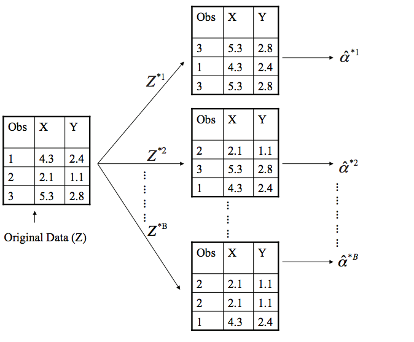
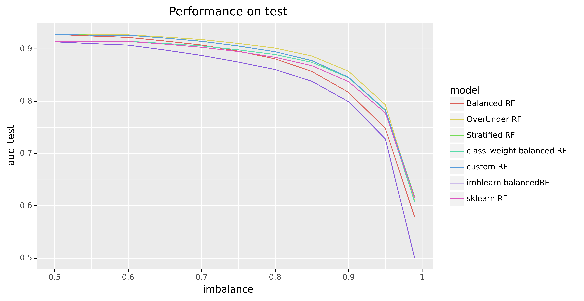

The RandomForest algorithm was introduced by Breiman back in 2001 ([paper](https://www.stat.berkeley.edu/~breiman/randomforest2001.pdf)). In 2022 it is still a commonly used algorithm by many data scientists. The only difference is that the current scikit-learn implementation combines classifiers by averaging their probabilistic prediction, instead of letting each classifier vote for a single class ([source](https://scikit-learn.org/stable/modules/ensemble.html#random-forests)).

In practice many classification problems are imbalanced: one class occurs more often than the other in the data. In 2004, three years after the original paper, Breiman authored the paper '[Using Random Forest to Learn Imbalanced Data](https://statistics.berkeley.edu/sites/default/files/tech-reports/666.pdf)' (Chen, Chao, Andy Liaw, and Leo Breiman). In it, he explains:

> In learning extremely imbalanced data, there is a significant probability that a bootstrap sample
contains few or even none of the minority class, resulting in a tree with poor performance for predicting
the minority class.

You can fix this by adjusting the bootstrap method in the random forest algorithm. For example by using a stratified bootstrap: sample with replacement from each class. This keeps the class imbalance. A further improved called the _balanced random forest_ is proposed by Breiman, which first bootstraps the minority class and then samples with replacement the same number of cases from the majority class.

The paper states that _balanced RF_ has 'performance superior to most of the existing techniques that we studied'. In this blogpost we'll replicate the results and run our own benchmarks, and see if and when a balanced RF would make sense to try in your own projects.

## Theory first: Bootstrapping in Random Forests

In case you don't have the theory top of mind: Random Forests work by ensembling a collection (forest) of decision trees fitted on bootstrapped (random) subsets of the data.

The real magic is in the bootstrapping. Rows (number of observations $n$) are sampled _with replacement_ until you have another set of size $n$. This means the same row can occurs multiple times in your sample. In fact, each bootstrap sample can be expected to contain $\approx$ 1/3 of observations ([source](https://stats.stackexchange.com/questions/88980/why-on-average-does-each-bootstrap-sample-contain-roughly-two-thirds-of-observat?lq=1)). As an aside, Random Forests also take a random subsample _without replacement_ of your columns (number of features $m$). This method is known as Random Patches ([read more](https://scikit-learn.org/stable/modules/ensemble.html#bagging-meta-estimator)). Empirically a [good value for classification problems](https://scikit-learn.org/stable/modules/ensemble.html#parameters) is `max_features = sqrt(n_features)`.

<figure class="figure">
  
  <figcaption class="figure-caption">Illustration of bootstrapping (<a href="https://uc-r.github.io/bootstrapping">source</a>)</figcaption>
</figure>

<!--  -->

## Experiment setup

Let's generate some data to create an imbalanced binary classification with a 10% minority class:

```python
from sklearn.datasets import make_classification

X, y = make_classification(n_samples = 10_000, n_features = 20, n_informative=15, n_redundant=2, n_classes=2, weights=[.9, .1], flip_y=0.05, random_state=42)
X = pd.DataFrame(X)
```

Fitting a random forest is straight forward:

```python
from sklearn.model_selection import train_test_split
from sklearn.ensemble import RandomForestClassifier

X_train, X_test, y_train, y_test = train_test_split(X, y, stratify=y, test_size=.2, random_state=42)

rf = RandomForestClassifier(max_depth=5, n_estimators=10, max_features='auto', random_state=42)
rf.fit(X_train, y_train)
```

For evaluation of different model variants we'll compute AUC (using [roc_auc_score](https://scikit-learn.org/stable/modules/generated/sklearn.metrics.roc_auc_score.html)) because it tells us how well the model is able to separate between classes (we are free to set the probability threshold later). Because in imbalanced classification problems we usually are interested in high prediction accuracy over the minority class, while maintaining reasonable accuracy for the majority class, _weighted accuracy_ (aka [`balanced_accuracy_score`](https://scikit-learn.org/stable/modules/generated/sklearn.metrics.balanced_accuracy_score.html), the average recall for each class) is also interesting. It does however require a probability threshold to be set so we will leave it out of the comparison for now.

Another challenge with evaluating classifiers on imbalanced data is that we can get lucky. If we change the random seed for our `train_test_split()` we might get a very difference performance (despite using stratified sampling). To get an idea of the *average* performance of our model we can train and evaluate over multiple random seeds. Making sure your results are not dependent on a lucky random seed is something that is often overlooked (although I do recommend 42 ;)). You could do 20 repeats of 5-fold cross validation using [`RepeatedStratifiedKFold`](https://scikit-learn.org/stable/modules/generated/sklearn.model_selection.RepeatedStratifiedKFold.html#sklearn.model_selection.RepeatedStratifiedKFold) bu instead I will just average the AUC metric over a fixed set of 100 random seeds used for `train_test_split()`.

The most fair comparison between model variants would be to do a grid search with equal compute resources on each model. For the purposes of this blogpost, we'll use default random forest hyperparameters with the exception of using `max_depth` of `7` and `min_samples_leaf` of 150 to avoid overfitting. That gives us:

| Model        | Train-AUC | Test-AUC |
|--------------|-----------|----------|
| Sklearn RF | 0.9280    | 0.8939   |


## Step 1: Our own RandomForest class

Before we can adapt the bootstrapping strategy, we need to implement a normal random forest to make sure we're not making any mistakes. We can re-use scikit-learn's `DecisionTreeClassifer` and overwrite the bootstrapping of the rows. I've highlighted parts relevant parts of my `CustomRandomForestClassifier` class, full code can be found at [github.com/timvink/experiment-balanced-bootstrapping](https://github.com/timvink/experiment-balanced-bootstrapping).

The `.fit()` method bootstraps a sample of our data and fits a decision tree model and repeats this `n_estimator` times:

```python
class CustomRandomForestClassifier():
    """
    Custom implementation of RF where we can change the bootstrapping method.
    """
    # ...      
    def fit(self, X: pd.DataFrame, y: np.array):

        if not isinstance(X, pd.DataFrame):
            X = pd.DataFrame(X)
        assert isinstance(y, np.ndarray)

        if self.random_state is not None:
            np.random.seed(self.random_state)

        trees = list()
        for i in range(self.n_estimators):

            # Get our bootstrapped data
            X_bootstrap, y_bootstrap = self._bootstrap_sample(X, y)
        
            # Fit a decision tree
            tree = DecisionTreeClassifier(
              max_depth = self.max_depth,
              min_samples_leaf = self.min_samples_leaf,
              max_features = self.max_features,
              random_state = self.random_state+i
            )
            tree.fit(X_bootstrap, y_bootstrap)
            trees.append(tree)

        self.trees = trees
        return self

```

The bootstrap itself is done with `numpy.randint`:

```python
    # ...
    def _bootstrap_sample(self, X: pd.DataFrame, y: np.ndarray) -> Tuple[pd.DataFrame, np.ndarray]:
        """
        Returns bootstrapped indices of X
        (same number of rows, sampled with replacement)

        Args:
          X: pandas dataframe

        Return:
          nd.array with indices
        """
        n_samples = X.shape[0]
        indices = np.random.randint(low=0, high=n_samples, size=n_samples)
        X_bootstrap = X.iloc[indices]
        y_bootstrap = y[indices]
        return X_bootstrap, y_bootstrap
```

And prediction is done with 'soft' voting (averaging all probabilities):

```python
    # ...
    def predict_proba(self, X: pd.DataFrame):
        """
        Here we use a 'soft' voting ensemble
        average all probabilities

        See https://github.com/scikit-learn/scikit-learn/blob/1495f69242646d239d89a5713982946b8ffcf9d9/sklearn/ensemble/voting.py#L320
        """
        probas = [clf.predict_proba(X) for clf in self.trees]
        probas = np.asarray(probas)
        avg = np.average(probas, axis=0)
        return avg
```

Then we can verify the implementation is correct:

| Model        | Train-AUC | Test-AUC | Delta |
|--------------|-----------|----------|-------|
| Custom RF | 0.8815 |	**0.8459**	| 0.0356 |
| sklearn RF	| 0.8682 |	0.8375 |	0.0307 |


Scores are similar but differ, which is likely due to a minor difference in implementation. We'll take it as is and use the custom RF as the baseline to start experimenting with different bootstrap techniques.

## Stratified bootstrapping

[Stratified Sampling](https://en.wikipedia.org/wiki/Stratified_sampling) means we make sure each bootstrap has the same percentage of samples of each target class as the complete set. Basically it's two bootstraps, one on the minority class and one on the majority class. Implementation is easy with sklearn's `resample()`:

```python
from sklearn.utils import resample

class StratifiedRandomForest(CustomRandomForestClassifier):    
    def _bootstrap_sample(self, X: pd.DataFrame, y: np.ndarray) -> Tuple[pd.DataFrame, np.ndarray]:
        """
        Stratified bootstrap sample.

        This means the class ratio should be the same in the bootstrap.
        """
        X_bootstrap, y_bootstrap = resample(X, y, stratify = y)
        return X_bootstrap, y_bootstrap
```

Performance degrades ever so slightly, but is still very similar to the base class. This might be more effective if we did not already stratify our train/test split as well.

| Model        | Train-AUC | Test-AUC | Delta | 
|--------------|-----------|----------|-------|
| Custom RF | 0.8815 |	**0.8459**	| 0.0356 |
| Stratified RF	 | 0.8813 |	0.8450 |	0.0363 |


## Balanced bootstrapping

Breiman's balanced random forest "first bootstraps the minority class and then samples with replacement the same number of cases from the majority class.". In code:

```python
class BalancedRandomForest(CustomRandomForestClassifier):
    def _bootstrap_sample(self, X: pd.DataFrame, y: np.ndarray) -> Tuple[pd.DataFrame, np.ndarray]:
        """
        Balanced bootstrap. Implementation of Breiman's BalancedRandomForest.

        We create a dataset with an articial equal class distribution:
        first bootstraps the minority class and then samples with replacement the same number of cases from the majority class.
        """
        # Find majority class, 0 or 1
        counts = np.bincount(y)
        minority_class = np.argmin(counts)
        n_minority = counts[minority_class]

        # bootstrap minority class
        indices_minority = np.random.choice(
            np.where(y == minority_class)[0],
            size = n_minority,
            replace = True)

        # bootstrap majority class with minority size
        indices_majority = np.random.choice(
            np.where(y != minority_class)[0],
            size = n_minority,
            replace = True)

        indices = np.hstack([indices_majority, indices_minority])
        np.random.shuffle(indices) # in-place
        
        X_bootstrap = X.iloc[indices]
        y_bootstrap = y[indices]
        return X_bootstrap, y_bootstrap
```

The results:

| Model        | Train-AUC | Test-AUC | Delta | 
|--------------|-----------|----------|-------|
| Custom RF | 0.8815 |	**0.8459**	| 0.0356 |
| Stratified RF	 | 0.8813 |	0.8450 |	0.0363 |
| Balanced RF	 | 0.8391 |	0.8171 |	0.0220 |

The `BalancedRandomForest` algorithm actually performs significantly worse. But because each tree sees less observations (2x size of minority class instead of a bootstrap of all observations), we might want to change the hyperparameters to regularize less (f.e. by increasing `max_depth` or decreasing `min_sample_leaf`) to do the algorithm more justice.

## Over Under sampling

While we're at it, we also create a `OverUnderRandomForest` where we sample with replacement from the minority class until we have 50% of $$n$$ (oversampling), and then sample with replacement from the majority class (undersampling).

The results:

| Model        | Train-AUC | Test-AUC | Delta | 
|--------------|-----------|----------|-------|
| OverUnder RF	 | 0.9023 |	**0.8574** |	0.0449 |
| Custom RF | 0.8815 |	0.8459	| 0.0356 |
| Stratified RF	 | 0.8813 |	0.8450 |	0.0363 |
| Balanced RF	 | 0.8391 |	0.8171 |	0.0220 |

Interestingly, our `OverUnderRandomForest` now has the best test score, but also seems to overfit more (as each decision tree sees more unique observations).

## Balancing class weight

Another 'trick' is to penalize mistakes on the minority class by an amount proportional to how under-represented it is. This is actually available as the `class_weight='balanced'` parameter in some sklearn algorithms and some packages like [xgboost](https://xgboost.readthedocs.io/en/latest/), and we'll throw it in there just for comparison.

```python
rf = RandomForestClassifier(**rf_params, class_weight='balanced')
```

For this particular problem it does not seem to help much though:

| Model        | Train-AUC | Test-AUC | Delta | 
|--------------|-----------|----------|-------|
| OverUnder RF	 | 0.9023 |	**0.8574** |	0.0449 |
| Custom RF | 0.8815 |	0.8459	| 0.0356 |
| class weight balanced RF	 | 0.8832 |	0.8452 |	0.0380 |
| Stratified RF	 | 0.8813 |	0.8450 |	0.0363 |
| Balanced RF	 | 0.8391 |	0.8171 |	0.0220 |

## Other tactics

Simple undersampling majority or oversampling minority on train/test split is already a very performant tactic. Undersampling majority for random forests might have a slight advantage ([Chen 2004](https://statistics.berkeley.edu/sites/default/files/tech-reports/666.pdf)). A more recent paper finds oversampling minority till balance the best strategy, at least for convolution neural networks ([Buda 2017](https://arxiv.org/abs/1710.05381)). It makes sense because undersampling means you throw away information, but you do need to have to computational resources to deal with the additional observations from oversampling.

Another common strategy is to adjust the probability threshold for a classifier after training it, which you can visualize using [yellowbrick.classifier.DiscriminationThreshold()](https://www.scikit-yb.org/en/latest/api/classifier/threshold.html) and find [interactively using streamlit](https://www.timvink.nl/streamlit-threshold-app/), or programmatically using [scikit-lego's Thresholder](https://scikit-lego.readthedocs.io/en/latest/meta.html#Thresholder)). You can even optimize your classifiers to focus on certain areas by considering partial AUC as a metric, which is supported in scikit-learn's [`roc_auc_score(max_fpr=...)`](https://scikit-learn.org/stable/modules/generated/sklearn.metrics.roc_auc_score.html).

## What about other imbalance ratios?

If you look at the results when varying the imbalance ratios the scores the differences are marginal. `OverUnderSampling` does seems to have a slight edge, but I'm sure if you spend a bit of time on hyperparameter tuning of each variant the differences would be even smaller.



## Conclusion

Experimeting with bootstrap sampling is definitely interesting, and can give you a slight edge, but your time is better spent just understanding your data and the modelling problem rather than exploring these slight model variants. There is no silver bullet, and I will keep using the 'vanilla' random forest implementation as it's a great and fast baseline to use before applying more complex models like gradient boosted models.

If you want to try a balanced RandomForest, you can use the [BalancedRandomForest](https://imbalanced-learn.readthedocs.io/en/stable/generated/imblearn.ensemble.BalancedRandomForestClassifier.html) implementation from [imbalanced-learn](https://imbalanced-learn.readthedocs.io/en/stable/), which also offers a lot of other algorithms and sampling techniques.